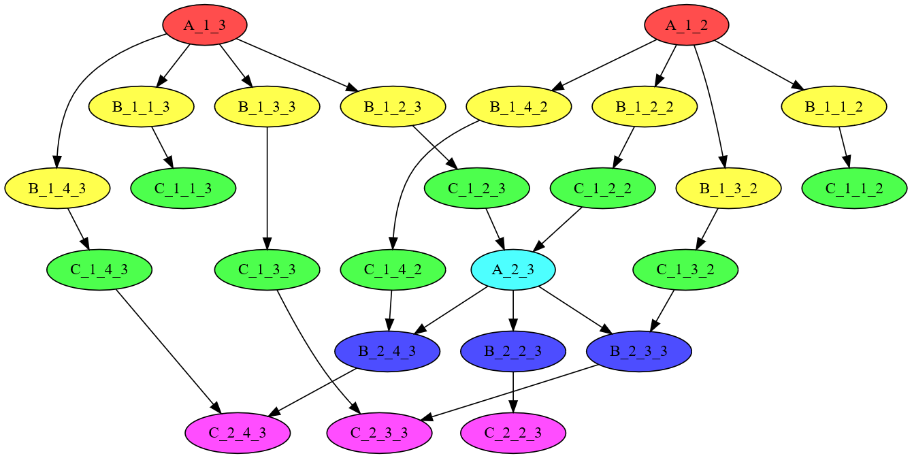
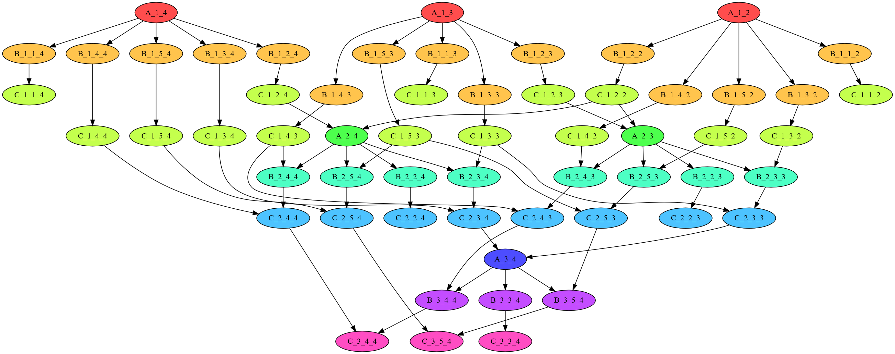

Gracjan Filipek, 409890

# Wstęp
Rozważania będą dotyczyć problemu rozwiązywania układów równań liniowych metodą eliminacji Gaussa. Problem można przedstawić jako $$M \times x = y$$, gdzie $M$ jest macierzą kwadratową, $x$ to wektor współczynników zmiennych, a $y$ to wektor wyrazów wolnych.

Analizie przy pomocy teorii śladów poddamy jedynie pierwszą część algorytmu rozwiązywania układu równań liniowych, czyli sprowadzanie macierzy do postaci trójkątnej górnej.

Przez cała długość rozważań konkretne przykłady będą podawane dla macierzy $3 \times 3$ (dzięki ppomocniczemu programowi) dla lepszego zrozumienia, chociaż całość jest oczywiście przygotowana dla dowolnej macierzy o rozmiarze $N \times N$.

# Oznaczenia
Indeksy macierzy $M$ o rozmiarze $N$ będą przyjmować wartości od $1$ do $N$.

Elementy macierzy $M$ będziemy indeksować jako $M_{i, j}$, gdzie $i$ to indeks wiersza, a $j$ - indeks kolumny.
$$
\begin{bmatrix}
M_{1,1} & M_{1,2} & M_{1,3} \\
M_{2,1} & M_{2,2} & M_{2,3} \\
M_{3,1} & M_{3,2} & M_{3,3}
\end{bmatrix}
$$

Elementy wektora $y$ będziemy indeksowac jako $y_i$.
$$
\begin{bmatrix}
y_1 \\
y_2 \\
y_3
\end{bmatrix}
$$

Całe równanie do rozwiązania:
$$
\begin{bmatrix}
M_{1,1} & M_{1,2} & M_{1,3} \\
M_{2,1} & M_{2,2} & M_{2,3} \\
M_{3,1} & M_{3,2} & M_{3,3}
\end{bmatrix}
\times
\begin{bmatrix}
x_1 \\
x_2 \\
x_3
\end{bmatrix}
=
\begin{bmatrix}
y_1 \\
y_2 \\
y_3
\end{bmatrix}
$$

Dla wygody macierz $M$ i wektor $y$ będziemy zapisywać razem.
$$
\begin{bmatrix}
M_{1,1} & M_{1,2} & M_{1,3} & | & y_1 \\
M_{2,1} & M_{2,2} & M_{2,3} & | & y_2 \\
M_{3,1} & M_{3,2} & M_{3,3} & | & y_3
\end{bmatrix}
$$

# Wyprowadzenie teoretyczne

## Określanie niepodzielnych czynności
Algorytm eliminacji Gaussa wykonuje trzy niepodzielne typy operacji:

  - $A_{i, k}$ - znalezienie mnożnika dla wiersza $i$, do odejmowania go od $k$-tego wiersza,<p> $m_{i, k} = M_{k, i} / M_{i, i}$

  - $B_{i, j, k}$ - pomnożenie $j$-tego elementu wiersza $i$ przez mnożnik - do odejmowania od $k$-tego wiersza,<p> $n_{i, j, k} = M_{i, j} \cdot m_{i, k}$

  - $C_{i, j, k}$ - odjęcie $j$-tego elementu wiersza $i$ od wiersza $k$,<p>$M_{k, j} = M_{k, j} - n_{i, j, k}$

## Alfabet w sensie teorii śladów
Aby wygenerować alfabet $\Sigma$ musimy zawrzeć wszystkie operacje, które będą musiały być wykonane podczas eliminacji Gaussa na macierzy $N \times N$. 
$$\Sigma = \{A_{i, k}, B_{i, j, k}, C_{i, j, k} : i=1,\dots,N-1; j=i,\dots,N+1; k=i+1,\dots,N\}$$

### Przykład
Alfabet dla macierzy $3 \times 3$ wygenerowany przez program:

$\Sigma = \{A_{1, 2}, B_{1, 1, 2}, C_{1, 1, 2}, B_{1, 2, 2}, C_{1, 2, 2}, B_{1, 3, 2}, C_{1, 3, 2}, B_{1, 4, 2}, C_{1, 4, 2},\\
A_{1, 3}, B_{1, 1, 3}, C_{1, 1, 3}, B_{1, 2, 3}, C_{1, 2, 3}, B_{1, 3, 3}, C_{1, 3, 3}, B_{1, 4, 3}, C_{1, 4, 3},\\
A_{2, 3}, B_{2, 2, 3}, C_{2, 2, 3}, B_{2, 3, 3}, C_{2, 3, 3}, B_{2, 4, 3}, C_{2, 4, 3}, \}$

## Relacje zależności i niezależnosci
Aby zbudować relację zależności musimy określić, które operacje będą od siebie zależne. Od razu jednak dołożymy starań i wyłapiemy tylko zależności "bezpośrednie", tzn. takie, które nie będą wynikały z tranzytywności relacji na podstawie jej innych "bezpośrednich" elementów. W ten sposób otrzymamy "skondensowany" zbiór $J$ (tak jakby "jądro" relacji), który posłuży zarówno do konstrukcji relacji zależności $D$ jak i zbioru krawędzi $E$ grafu Diekerta.

 1. Wykonanie $B_{i,j,k}$ wymaga najpierw wykonania
 $A_{i, k}$ ([musimy znać mnożnik $m_{i, k}$](#określanie-niepodzielnych-czynności)),
 dlatego niech
 $$J_1 = \{(A_{i, k}, B_{i, j, k}): A_{i,k}, B_{i,j,k} \in \Sigma\}$$
 
 2. Wykonanie $C_{i, j, k}$ wymaga najpierw wykonania
 $B_{i, j, k}$ ([musimy znać odjemnik $n_{i, j, k}$](#określanie-niepodzielnych-czynności)),
 dlatego niech
 $$J_2 = \{(B_{i, j, k}, C_{i, j, k}): B_{i, j, k}, C_{i, j, k} \in \Sigma\}$$

 3. Operacja $A_{i,k}$ korzysta z wartości $M_{i,i}$ i $M_{k,i}$, a te muszą być uprzednio zmodyfikowane przez odpowiednio $C_{i-1,i,i}$ i $C_{i-1,i,k}$. Nie dotyczy to "pierwszych" $A$, tzn. $A$ postaci $A_{1, k}$. Zatem niech
 $$J_3 = \{(C_{i-1,i,i}, A_{i,k}): C_{i-1,i,i}, A_{i,k} \in \Sigma \wedge i \neq 1\} \cup \{(C_{i-1,i,k}, A_{i,k}): C_{i-1,i,k}, A_{i,k} \in \Sigma \wedge i \neq 1\}$$

 4. Operacja $C_{i,j,k}$ musi być wykonana po $C_{i-1, j, k}$ (korzystają z tej samej zmiennej $M_{k,j}$). Używamy warunku $i \neq j$, ponieważ $C_{i,j,k}$ zależy od $C_{i-1,j,k}$ pośrednio, więc nie spełniają warunku o "bezpośredniości". Niech
 $$J_4 = \{(C_{i,j,k}, C_{i-1,j,k}): C_{i,j,k}, C_{i-1,j,k} \in \Sigma \wedge i \neq j\}$$

 5. Operacja $B_{i,j,k}$ korzysta z wartości $M_{i,j}$, której wartość jest modyfikowana przez operację $C_{i-1,j,k-1}$. Analogicznie po powyższego podpunktu, $B_{i, j, k}$ zależy od $C_{i-1, j, k-1}$ pośrednio, więc to pomijamy. Zatem niech
 $$J_5 = \{(C_{i-1, j, k-1}, B_{i, j, k}): C_{i-1, j, k-1}, B_{i, j, k} \in \Sigma \wedge i \neq j\}$$

Dzięki tak zdefiniowanym zmiennym pomocniczym określmy $J$. Niech $J = J_1 \cup J_2 \cup J_3 \cup J_4 \cup J_5$.
Wtedy $$D = \text{sym}(J^+) \cup I_\Sigma$$, gdzie :

  - $D$ - relacja zależności
  - $\square^+$ - domknięcie tranzytywne relacji
  - $I_\Sigma$ = $\{(x, x): x \in \Sigma\}$
  - sym - dodaje odpowiednie relacje do $J^+$ w taki sposób, aby zachodziła własność $(\forall x, y \in \Sigma: (x, y) \in J^+ \Leftrightarrow (y, x) \in J^+)$

Relacja niezależności to po prostu
    $$I = \Sigma^2 / D$$
tzn. wszystkie pary, które nie są zależne, są niezależne.

### Przykład
Dla macierzy $3 \times 3$ mamy wygenerowane:

$J_1 = \{(A_{1, 2}, B_{1, 1, 2}), (A_{1, 2}, B_{1, 2, 2}), (A_{1, 2}, B_{1, 3, 2}), (A_{1, 2}, B_{1, 4, 2}),\\
(A_{1, 3}, B_{1, 1, 3}), (A_{1, 3}, B_{1, 2, 3}), (A_{1, 3}, B_{1, 3, 3}), (A_{1, 3}, B_{1, 4, 3}),\\
(A_{2, 3}, B_{2, 2, 3}), (A_{2, 3}, B_{2, 3, 3}), (A_{2, 3}, B_{2, 4, 3})\}$

$J_2 = \{(B_{1, 1, 2}, C_{1, 1, 2}), (B_{1, 2, 2}, C_{1, 2, 2}), (B_{1, 3, 2}, C_{1, 3, 2}), (B_{1, 4, 2}, C_{1, 4, 2}),\\
(B_{1, 1, 3}, C_{1, 1, 3}), (B_{1, 2, 3}, C_{1, 2, 3}), (B_{1, 3, 3}, C_{1, 3, 3}), (B_{1, 4, 3}, C_{1, 4, 3}),\\
(B_{2, 2, 3}, C_{2, 2, 3}), (B_{2, 3, 3}, C_{2, 3, 3}), (B_{2, 4, 3}, C_{2, 4, 3})\}$

$J_3 = \{(C_{1, 2, 2}, A_{2, 3}), (C_{1, 2, 3}, A_{2, 3})\}$

$J_4 = \{(C_{1, 3, 3}, C_{2, 3, 3}), (C_{1, 4, 3}, C_{2, 4, 3})\}$

$J_5 = \{(C_{1, 3, 2}, B_{2, 3, 3}), (C_{1, 4, 2}, B_{2, 4, 3})\}$

$J = \{(A_{1, 2}, B_{1, 1, 2}), (A_{1, 2}, B_{1, 2, 2}), (A_{1, 2}, B_{1, 3, 2}), (A_{1, 2}, B_{1, 4, 2}),\\
(A_{1, 3}, B_{1, 1, 3}), (A_{1, 3}, B_{1, 2, 3}), (A_{1, 3}, B_{1, 3, 3}), (A_{1, 3}, B_{1, 4, 3}),\\
(A_{2, 3}, B_{2, 2, 3}), (A_{2, 3}, B_{2, 3, 3}), (A_{2, 3}, B_{2, 4, 3}),\\
(B_{1, 1, 2}, C_{1, 1, 2}), (B_{1, 2, 2}, C_{1, 2, 2}), (B_{1, 3, 2}, C_{1, 3, 2}), (B_{1, 4, 2}, C_{1, 4, 2}),\\
(B_{1, 1, 3}, C_{1, 1, 3}), (B_{1, 2, 3}, C_{1, 2, 3}), (B_{1, 3, 3}, C_{1, 3, 3}), (B_{1, 4, 3}, C_{1, 4, 3}),\\
(B_{2, 2, 3}, C_{2, 2, 3}), (B_{2, 3, 3}, C_{2, 3, 3}), (B_{2, 4, 3}, C_{2, 4, 3}),\\
(C_{1, 2, 2}, A_{2, 3}), (C_{1, 2, 3}, A_{2, 3}),\\
(C_{1, 3, 3}, C_{2, 3, 3}), (C_{1, 4, 3}, C_{2, 4, 3}),\\
(C_{1, 3, 2}, B_{2, 3, 3}), (C_{1, 4, 2}, B_{2, 4, 3})\}$

## Sprowadzanie do macierzy trójkątnej górnej jako ciąg symboli alfabetu
Najpierw podamy w pseudokodzie algorytm do sprowadzania macierzy do postaci trójkątnej górnej. Nie uwzględniamy konieczności pivotingu. Tablice / wektory i macierze indeksujemy od jedynki.

```Python
def reduce_to_upper_triangular_matrix(matrix M):
    N = number_of_rows(M)
    
    for i = 1, ..., N-1:
        for k = i+1, ..., N:
            m = M[k][i] / M[i][i]   # operacja A_i_k

            for j = i, ..., N+1:
                n =  M[i][j] * m    # operacja B_i_j_k
                M[k][j] -= n        # operacja C_i_j_k
```

Dzięki napisaniu tego pseudokodu można łatwo "przetłumaczyć" ten algorytm  na słowo $w$ alfabetu $\Sigma$.

$N$ to wciąż liczba wierszy macierzy $M$.

Symbol $\frown$ oznacza konkatenację.

Zdefiniujmy pomocniczo $p_{i, k}$ i $q_{i, k}$ jako
$$p_{i, k} = A_{i,k} \frown q_{i, k}$$
$$q_{i, k} = B_{i, i, k} \frown C_{i, i, k} \frown B_{i, i+1, k} \frown C_{i, i+1, k} \frown \dots \frown B_{i, N, k} \frown C_{i, N, k} \frown B_{i, N+1, k} \frown C_{i, N+1, k}$$

Wtedy słowo $w$ będzie postaci
$$w = p_{1,2} \frown p_{1,3} \frown \dots \frown p_{1,N} \frown  p_{2, 3} \frown p_{2, 4} \frown \dots \frown p_{2, N} \frown \dots \frown p_{N-1, N-1} \frown p_{N-1, N}$$

### Przykład
Dla macierzy $3 \times 3$:

$w = A_{1, 2} \frown B_{1, 1, 2} \frown C_{1, 1, 2} \frown B_{1, 2, 2} \frown C_{1, 2, 2} \frown B_{1, 3, 2} \frown C_{1, 3, 2} \frown B_{1, 4, 2} \frown C_{1, 4, 2} \frown A_{1, 3} \frown B_{1, 1, 3} \frown C_{1, 1, 3} \frown B_{1, 2, 3} \frown C_{1, 2, 3} \frown B_{1, 3, 3} \frown C_{1, 3, 3} \frown B_{1, 4, 3} \frown C_{1, 4, 3} \frown A_{2, 3} \frown B_{2, 2, 3} \frown C_{2, 2, 3} \frown B_{2, 3, 3} \frown C_{2, 3, 3} \frown B_{2, 4, 3} \frown C_{2, 4, 3} \frown$

## Graf Diekerta
Dzięki odpowiedniemu zdefiniowaniu [$J_1, J_2, J_3, J_4, J_5$](#relacje-zależności-i-niezależnosci) bardzo łatwo będzie wyprowadzić krawędzie grafu Diekerta $E$, gdyż :
$$E = J = J_1 \cup J_2 \cup J_3 \cup J_4 \cup J_5$$

Zbiór $E$ to zbiór krawędzi grafu Diekerta, a $\Sigma$ to jego wierzchołki
$$DG = (\Sigma, E)$$

### Przykład
Wygenerowany graf Diekerta dla macierzy $3 \times 3$ przy pomocy strony do interpretacji grafów w formacie DOT - [GraphvizOnline](https://dreampuf.github.io/GraphvizOnline/).



### Przykład
Wygenerujmy jeszcze taki graf dla macierzy $4 \times 4$



## Postać normalna Foaty
Z wygenerowanych powyżej grafów Diekerta można stosunkowo łatwo zauważyć regularność w kolejnych warstwach.

Niech 
$$F_{A_r} = \{A_{r, k}: k = r+1, \dots, N\}$$
$$F_{B_r} = \{B_{r, s, t}: s = r, \dots, N+1; t = r+1, \dots, N\}$$
$$F_{C_r} = \{C_{r, s, t}: s = r, \dots, N+1; t = r+1, \dots, N\}$$

Wtedy klasy Foaty to
$$F = [F_{A_1}][B_{A_1}][F_{C_1}][F_{A_2}][B_{A_2}][F_{C_2}]\dots[F_{A_{N-1}}][B_{A_{N-1}}][F_{C_{N-1}}]$$

### Przykład
Dla macierzy $3 \times 3$ mamy

$F = [F_1][F_2][F_3][F_4][F_5][F_6]$

$F_1 = \{A_{1, 2}, A_{1, 3}, \}$

$F_2 = \{B_{1, 2, 2}, B_{1, 3, 3}, B_{1, 1, 2}, B_{1, 2, 3}, B_{1, 1, 3}, B_{1, 4, 2}, B_{1, 3, 2}, B_{1, 4, 3}, \}$

$F_3 = \{C_{1, 2, 2}, C_{1, 3, 3}, C_{1, 1, 2}, C_{1, 2, 3}, C_{1, 1, 3}, C_{1, 4, 2}, C_{1, 3, 2}, C_{1, 4, 3}, \}$

$F_4 = \{A_{2, 3}, \}$

$F_5 = \{B_{2, 4, 3}, B_{2, 3, 3}, B_{2, 2, 3}, \}$

$F_6 = \{C_{2, 4, 3}, C_{2, 3, 3}, C_{2, 2, 3}, \}$

### Przykład
Dla macierzy $4 \times 4$ mamy

$F = [F_1][F_2][F_3][F_4][F_5][F_6][F_7][F_8][F_9]$

$F_1 = \{A_{1, 2}, A_{1, 3}, A_{1, 4}, \}$

$F_2 = \{B_{1, 2, 2}, B_{1, 3, 3}, B_{1, 4, 4}, B_{1, 1, 2}, B_{1, 2, 3}, B_{1, 3, 4}, B_{1, 1, 3}, B_{1, 2, 4}, B_{1, 1, 4}, B_{1, 5, 2}, B_{1, 4, 2}, B_{1, 5, 3}, B_{1, 3, 2}, B_{1, 4, 3}, B_{1, 5, 4}, \}$

$F_3 = \{C_{1, 2, 2}, C_{1, 3, 3}, C_{1, 4, 4}, C_{1, 1, 2}, C_{1, 2, 3}, C_{1, 3, 4}, C_{1, 1, 3}, C_{1, 2, 4}, C_{1, 1, 4}, C_{1, 5, 2}, C_{1, 4, 2}, C_{1, 5, 3}, C_{1, 3, 2}, C_{1, 4, 3}, C_{1, 5, 4}, \}$

$F_4 = \{A_{2, 3}, A_{2, 4}, \}$

$F_5 = \{B_{2, 4, 3}, B_{2, 5, 4}, B_{2, 3, 3}, B_{2, 4, 4}, B_{2, 3, 4}, B_{2, 2, 3}, B_{2, 2, 4}, B_{2, 5, 3}, \}$

$F_6 = \{C_{2, 4, 3}, C_{2, 5, 4}, C_{2, 3, 3}, C_{2, 4, 4}, C_{2, 3, 4}, C_{2, 2, 3}, C_{2, 2, 4}, C_{2, 5, 3}, \}$

$F_7 = \{A_{3, 4}, \}$

$F_8 = \{B_{3, 5, 4}, B_{3, 4, 4}, B_{3, 3, 4}, \}$

$F_9 = \{C_{3, 5, 4}, C_{3, 4, 4}, C_{3, 3, 4}, \}$

# Implementacja algorytmu współbieżnego
Algorytm zaprojektowany został tak, aby w każdej iteracji równolegle wykonywały się wszystkie operacje z jednek warstwy Foaty.

Program został napisany w Javie 17 przy pomocy systemu do zarządzania projektem Gradle z Kotlinem w roli DSL. 

## Liczność największej klasy Foaty
Aby niepotrzebnie nie tworzyć i nie niszczyć wątków dla pojedyńczych operacji, posłużymy sie klasą ExecutorService. Dobrze byłoby wiedzieć, ile maksymalnie wątków będziemy potrzebować jednocześnie, aby od razu zaalokować odpowiednią ich ilość. Dlatego wygenerowałem warstwy Foaty dla coraz większych rozmiarów macierzy i sprawdzałem, jaka jest najliczniejsza wartwa. Oto obserwacje:

| $N$ | $N^2$ | najliczniejsza warstwa Foaty |
|:-----:|:--:|:-------:|
|2|4|3|
|3|9|8|
|4|16|15|
|5|25|24|
|6|36|35|
|7|49|48|

Wydaje się, że prawdziwą jest zależność:
$$\text{najliczniejsza warstwa Foaty}(N) = N^2 - 1$$

## Zawartość katalogu z kodem źródłowym
W katalogu `src/main/java/tt` znajdują się 3 katalogi:

  - concurrent_gaussian_elimination - implementacja współbieżnego algorytmu eliminacji Gaussa opartego na rozkładzie tego problemu na klasy Foaty, które to zostały wyprowadzone i ukazane w tym dokumencie
  - documentation - kod pomocniczy, który posłużył do generowania na potrzeby tej dokumentacji m.in alfabetu liter $\Sigma$, relacji zależności, krawędzi grafu Diekerta i samego grafu Diekerta w formaie DOT
  - operations - klasy pomocnicze, używane w całym projekcie

## Użycie
Aby uruchomic aplikację najłatwiej jest skorzystać z dowolnego IDE obsługującego Gradle'a. Należy przejśc do klasy 

`src/main/java/tt/concurrent_gaussian_elimination/ConcurrentLinearEquationSolver.java`

 i uruchomić funkcje `main` z następującymi dwoma argumentami:
`[inputFilePath] [outputFilePath]`, gdzie:

 - `inputFilePath` - ścieżka do pliku zawierającego dane wejściowe w odpowiedniej formie,
 - `outputFilePath` - ścieżka do pliku wyjściowego, w którym zapisany zostanie wynik działania programu.

Można także posłużyć się terminalem i uruchomić aplikację używając skryptu `gradlew.bat` (Windows) lub `gradlew` (Linux, macOS) i zadania `run` z podanymi odpowiednimi argumentami wejściowymi (jak wyżej). Przykład pełnego wywołania:

`gradlew.bat run --args="[inputFilePath] [outputFilePath]"`,

## Poprawność programu
Poprawność działania apikacji została przeze mnie sprawdzona dla kilku macierzy o różnych rozmiarach (od 3 do 100) przy pomocy podanej [sprawdzarki](https://github.com/macwozni/Matrices), która generowała kolejne macierze i sprawdzała poprawność danych wynikowych z mojego programu. Wszystkie macierze i wektory wyrazów wolnych zostały uznane za poprawne (z dokładnością do epsilona) przez sprawdzarkę.
