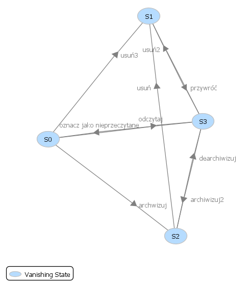

## Gracjan Filipek 409890

# Zad. 1
## Sieć Petriego:
Moja przygotowana sieć symuluje stan wiadomości w skrzynce emailowej. Sieć Petriego:

## Analiza sieci przez PIPE2:

## Graf osiągalności:

Jak widać, ze znakowania początkowego osiągalne są 4 znakowania. Co istotne, w każdym z tych znakowań maksymalna sumaryczna liczba tokenów wynosi 1, co oznacza, że sieć jest 1-ograniczona, czyli jest bezpieczna. 

Każde z przejść pojawia się na grafie, czyli żadne przejście nie jest martwe.

Dla każdego znakowania można odpalić (po pewnym ciągu przejść) dowolne przejście, czyli wszystkie przejścia są żywe, zatem sieć jest żywa. Można też wyciągnąć z tego wniosek, że nie są możliwe zakleszczenia.

W każdym znakowaniu suma tokenów wynosi 1, czyli sieć jest zachowawcza.

## Niezmienniki:

### Niezmienniki przejść:
Z każdego znakowania mogę "wrócić" do niego samego poprzez wykonanie niezerowej liczby przejść, zatem siec jest odwracalna.

### Niezmienniki miejsc:
Sieć jest zachowawcza, a wynika to z równania, które ustala sumaryczną liczbę tokenów we wszystkich miejscach na 1.

Liczba tokenów w każdym niezmienniku wynosi co najwyżej jeden, a zatem sieć jest 1-ograniczona, czyli jest bezpieczna.

# Zad. 2
## Sieć Petriego:

## Analiza sieci przez PIPE2:

## Graf osiągalności:

Każde z przejść pojawia się na grafie, czyli żadne przejście nie jest martwe.

Dla każdego znakowania można odpalić (po pewnym ciągu przejść) dowolne przejście (bo T0, T1 i T2 są w cyklu), czyli wszystkie przejścia są żywe, zatem sieć jest żywa. Ponieważ każda ścieżka prowadzi do tego cyklu, można też od razu wyciągnąć z tego wniosek, że nie są możliwe zakleszczenia.

Sieć na pewno nie jest ograniczona. Po najechaniu na któreś ze znakowań w cyklu widać, że miejsce czwarte może mieć potencjalnie nieskończenie wiele tokenów. Wynika to też z "ręcznej" analizy P4, w którym możemy dokładać tokenów (na skutek działania cyklu P0 -> P1 -> P2), a nie możemy ich odejmować.

## Niezmienniki:

### Niezmienniki przejść:
Nie istnieje żaden niezmiennik przejść, więc sieć nie jest odwracalna.

# Zad. 3
## Sieć Petriego:

## Niezmienniki:

### Niezmienniki miejsc:
Równania niezmienników miejsc tłumaczą sumaryczną liczbę tokenów na danych miejscach. Równanie M(Wolny) + M(Zajęty) = 1 mówi, że dla każdego osiągalnego znakowania suma tokenów na miejscach Wolny i Zajęty będzie wynosić 1.

Działanie ochrony sekcji krytycznej pokazuje, cóż, jedyne podane równanie.

# Zad. 4
## Sieć Petriego:

## Niezmienniki:

### Niezmienniki przejść:
Cała sieć jest pokryta przez niezmienniki przejść, dlatego z pewnością jest odwracalna.

### Niezmienniki miejsc:
Cała sieć jest pokrywalna przez rozłączne niezmienniki, czyli suma tokenów będzie zawsze wynosić:
 - 1 dla miejsc P0, P1 i P2
 - 1 dla miejsc P3, P4 i P5
 - 3 dla miejsc P6 i P7

Dzięki rozłączności równań, możemy je do siebie dodać stronami. Otrzymamy:

M(P0) + M(P1) + M(P2) + M(P3) + M(P4) + M(P5) + M(P6) + M(P7) = 5

Zatem sieć ta jest zachowawcza.

O rozmiarze bufora informuje nas równanie M(P6) + M(P7) = 3

# Zad. 5
## Sieć Petriego:

## Niezmienniki:

### Niezmienniki przejść:
Cała sieć jest pokryta niezmiannikami przejść, więc jest odwracalna.

### Niezmienniki miejsc:
Miejsce P6 nie należy do żadnego niezmiennika. Potwierdza to, że służy ono jako bufor nieskończony.

# Zad. 6
## Sieć Petriego:

## Analiza sieci przez PIPE2:

Analiza faktycznie wskazuje na możliwość zaistnienia deadlocka. Wskazana też jest najkrótsza prowadząca do niego ścieżka.

## Graf osiągalności:

Z grafu wynika, że deadlockiem jest markowanie {0, 1}, co zgadza się z rysunkiem sieci, bo wtedy token znajdowałby się na miejscu P1 i nie moglibyśmy wykonać żadnego przejścia.
